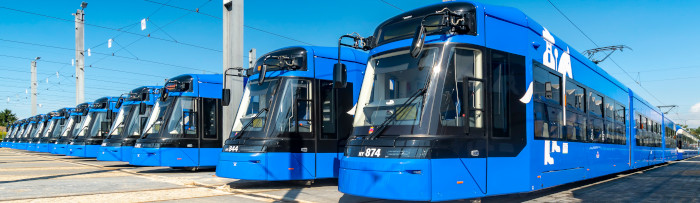

# Public-transport-in-Krakow

###  TEAM 
1. Oleksandra Kasatkina
2. OleksandraKasatkina
3. 1, 2, 3, 4, 5, 6

### INTRODUCTION
**Krakow**, one of Poland's oldest and most beautiful cities, boasts a well-developed public transport system that connects various parts of the city effectively. The system includes buses, trams, taxis, and bike rentals, making it easy for both locals and tourists to navigate the city. The transport network operates efficiently, providing timely services that enhance accessibility and reduce the need for personal vehicles, thus helping to alleviate traffic congestion.

Public transport in Krakow is designed to cater to a wide range of needs, ensuring that all residents and visitors have access to reliable transportation options. The integration of various modes of transport means that travelers can seamlessly switch between buses and trams without confusion. Moreover, with ticket prices that are quite affordable, public transport serves as an economical choice for many, encouraging its use over more expensive alternatives like taxis.

In recent years, Krakow has taken steps to modernize its public transport infrastructure. This includes introducing eco-friendly buses and trams to reduce pollution and improve the overall quality of life in the city. By prioritizing sustainability, Krakow not only enhances its image as a progressive city but also sets a standard for other cities in Poland and beyond. The ongoing efforts to improve public transport are crucial as they align with global trends toward greener urban living.

### DATA
The table below summarizes key aspects of public transport in Krakow, highlighting the various modes of transport available, their fare structures, and operational hours. This information is essential for anyone looking to use public transport effectively while visiting or residing in the city.

| Transport Type | Fare (PLN) | Operating Hours       | Accessibility     |
|----------------|------------|-----------------------|--------------------|
| Bus            | From 4.00 to 6.00 | 05:00 - 23:00         | Yes                |
| Tram           | From 4.00 to 6.00 | 05:00 - 23:00         | Yes                |
| Taxi           | 8.00 + 2.00/km | 24/7             | Yes                |

### IMAGES

